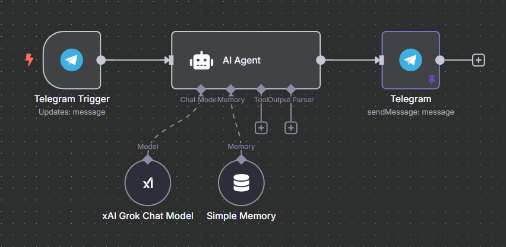

# 🤖 Telegram Bot + Grok API: AI Reply Workflow (n8n)

This n8n workflow connects a **Telegram Bot** with **Grok API** to create a simple AI assistant. When a user sends a message to the bot, the message is forwarded to Grok with a pre-defined prompt. Grok returns a response, and the bot replies to the user with it.

---

## 🔧 Tools Used

- [n8n](https://n8n.io/) – workflow automation
- **Telegram Bot API** – to receive and send messages
- **Grok API** – to generate AI responses based on prompts

---

## 🔧 Telegram Bot Setup

1. Create a Telegram bot using @BotFather

2. Copy the token and add it in n8n under Credentials → Telegram Bot API

3. In the Telegram node, choose your bot credentials and set the chat ID

---

## 🔧 Grok API Setup

1. Sign up at [https://x.ai/api]

2. Get your API key/token from the dashboard

3. In the xAI Grok Chat Model node fill your grok credential.

---

## 🔄 Workflow Steps

1. **Telegram Trigger**
   - Listens for new messages from users.
   - Extracts the message text and `chat_id`.

2. **Set Prompt**
   - Adds a pre-defined prompt and inserts the user's message.
   - Example prompt:
     ```
     You are a helpful assistant for an online store that sells 3D-printed items    
     (like accessories, gifts, home decor, or custom parts).
        - Answer politely and clearly.
        - Keep replies under 100 words.
        - Focus on assisting with product questions, customization options, pricing, or delivery.
        - If the message is unclear, ask a short, polite follow-up question.:

     User: {{message}}
     ```

3. **Send to Grok API**
   - Sends a POST request to Grok API with the constructed prompt.
   - Includes API key and other parameters in the request body.

4. **Extract AI Response**
   - Parses the JSON returned by Grok.
   - Gets the AI-generated message.

5. **Send Telegram Reply**
   - Sends the AI response back to the user using their `chat_id`.

---

## 🖼️ Visual Overview



### 📄 Download or View the Workflow

👉 [Click here to view `workflow.json`](./workflow.json)

You can import this file directly into your n8n instance.